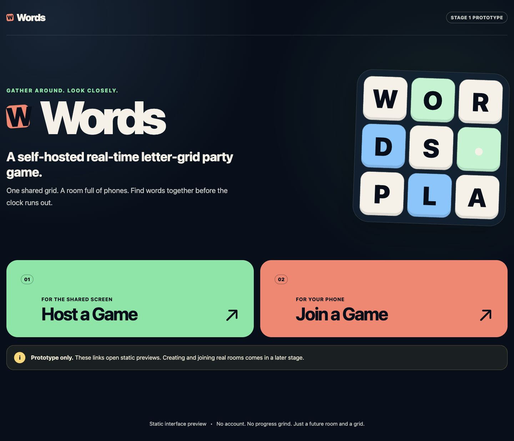
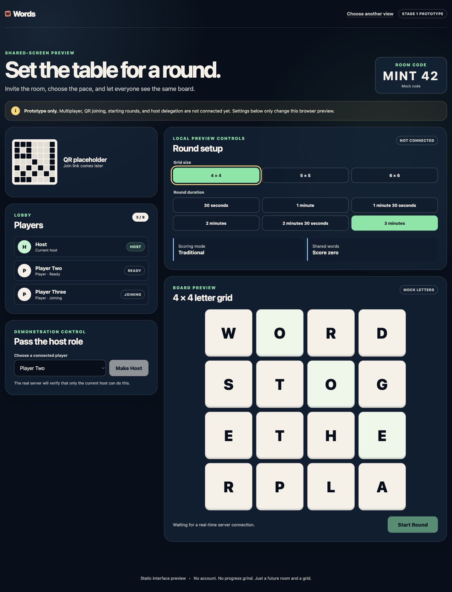
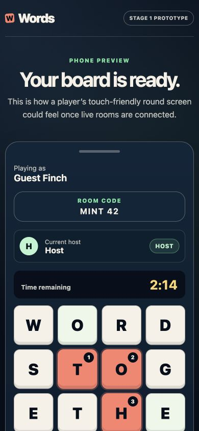

# Words

> A self-hosted real-time letter-grid party game.

Words is designed for a shared screen and a room full of phones. A host will
create a temporary room, players will join quickly without accounts, and
everyone will search the same letter grid before time runs out.

This repository is at **Stage 1: repository foundation and static interface
prototype**. It is not multiplayer-ready or production-ready.

## What works today

- A responsive role-selection page at `/`
- A static shared-screen host preview at `/host`
- A static phone-oriented player preview at `/play/demo`
- Local-only demonstration controls for grid size and round duration
- Generic 4 × 4, 5 × 5, and 6 × 6 board rendering
- Central product and game-setting configuration
- Strict TypeScript, formatting, linting, unit tests, component tests, and a
  production frontend build
- Beginner-friendly product, architecture, game, deployment, and security docs

## Prototype screenshots

Desktop role selection:



Shared-screen host preview:



Portrait player preview:



## What is not implemented

Stage 1 has no functional server, rooms, room joining, QR codes, Socket.IO
connection, host transfer, synchronized timer, touch word tracing, dictionary,
word validation, scoring, persistence, container, or deployment automation.
Buttons that need those systems are visibly disabled.

## Product principles

- No account, sign-in, email, profile, or tutorial is required.
- Rooms, games, and results are temporary. A database is not initially needed.
- There are no unlocks, progression systems, advertisements, or purchases.
- The future server—not a player’s browser—will own the board, deadline,
  settings, host role, validation, and scores.
- The visual identity and wording are original. Bundled assets and dictionaries
  must be original or compatibly licensed, with license and attribution recorded.

The intended public URL is `https://words.atlee.io`. The eventual production
application will listen on TCP port `6532`.

## Prerequisites

Install:

- [Node.js 24 LTS](https://nodejs.org/)
- npm (included with a normal Node.js installation)
- Git for branch and pull-request work

Check your installation:

```bash
node --version
npm --version
git --version
```

The Node version should begin with `v24`.

## Install and run locally

From the repository root:

```bash
npm install
npm run dev
```

Vite prints a local address, normally `http://localhost:5173`. Open it in a
browser. Vite’s port is only for fast frontend development with live updates.
The future combined Node.js production application and container will use port
`6532`; Stage 1 does not include that production server yet.

Open the prototype routes:

- Home and role selection: `http://localhost:5173/`
- Shared-screen host preview: `http://localhost:5173/host`
- Phone player preview: `http://localhost:5173/play/demo`

Stop the development server with `Control+C`.

## Useful commands

Run these from the repository root:

```bash
npm run dev           # Start the Vite development server
npm run format        # Format source and documentation
npm run format:check  # Check formatting without changing files
npm run lint          # Check code quality
npm run typecheck     # Check strict TypeScript
npm test              # Run all Stage 1 tests once
npm run build         # Build the static frontend into apps/client/dist
```

## Repository structure

```text
.
├── apps/
│   ├── client/       # Stage 1 React and Vite interface
│   └── server/       # Future Express and Socket.IO application
├── packages/
│   ├── shared/       # Shared product configuration and future payload types
│   └── game-engine/  # Future framework-independent game rules
├── data/             # Future openly licensed dictionary data
├── docs/             # Product and technical decisions in plain language
├── tests/            # Future cross-package and integration tests
├── unraid/           # Future deployment listing work
└── .github/workflows # Future checks and container publishing
```

The root `package.json` uses npm workspaces. This lets the browser app, future
server, shared definitions, and game engine live in one repository while
remaining clearly separated.

## Planned architecture

The eventual browser client will use React. A single Node.js process will use
Express to serve the built client and Socket.IO for real-time messages. The
server will keep temporary rooms in memory and call a React-independent game
engine. Shared TypeScript definitions and Zod schemas will keep browser and
server messages aligned.

The first deployment target is one container on Unraid, published through a
Cloudflare Tunnel at `https://words.atlee.io`. See
[`docs/ARCHITECTURE.md`](docs/ARCHITECTURE.md) and
[`docs/DEPLOYMENT.md`](docs/DEPLOYMENT.md). This flow is planned, not
implemented.

## Planned game settings

Supported board sizes will be 4 × 4, 5 × 5, and 6 × 6, with 4 × 4 as the
default. Supported round durations will be 30 seconds, 1 minute, 1 minute 30
seconds, 2 minutes, 2 minutes 30 seconds, and 3 minutes. The default is 3
minutes.

Traditional scoring is the initial default:

| Word length          |  Points |
| -------------------- | ------: |
| Fewer than 3 letters | Invalid |
| 3–4 letters          |       1 |
| 5 letters            |       2 |
| 6 letters            |       3 |
| 7 letters            |       5 |
| 8 or more letters    |      11 |

Shared words will eventually score zero for every player who submitted them by
default. Other scoring and duplicate modes are future options.

## Host delegation

Host delegation is required for the finished product. The current host will be
able to choose a connected player and request “Make Host.” The server must
verify the current host’s separate authority before transferring control and
broadcasting the updated room state. Stage 1 only shows the disabled control;
it does not implement authority.

## Troubleshooting

### `node` or `npm` is not found

Install Node.js 24 LTS, close and reopen the terminal, then run the version
checks above.

### `npm install` fails

Confirm that you have an internet connection and are in the repository root.
If a partial install was interrupted, run `npm install` again. Do not use
administrator privileges for a project-local install.

### The port is already in use

Vite will usually offer another local port. Use the exact URL it prints. This
does not change the future production port `6532`.

### A direct prototype URL shows a server 404

Use the Vite development server started by `npm run dev`. Vite provides the
single-page fallback for `/host` and `/play/demo`.

## What I should learn from this stage

Stage 1 is a small example of how a project grows safely:

1. Git records a reviewable history on a focused branch.
2. npm workspaces organize related TypeScript packages.
3. React turns small components into complete pages.
4. Shared configuration prevents important values from drifting.
5. Tests check behavior; TypeScript, ESLint, and Prettier check different parts
   of code quality.
6. Documentation records the intended behavior before complex multiplayer work
   begins.

## Next stage

A recommended Stage 2 is the smallest server-backed lobby slice: add the Express
server and health endpoint, define shared Zod payloads, create and join
temporary in-memory rooms through Socket.IO, assign server-controlled host
authority, expire abandoned rooms, and test authorization and malformed
payloads. It should not yet include the full game engine, dictionary, scoring,
or production deployment.

## License

Words source code is available under the [MIT License](LICENSE). Third-party
packages retain their own licenses. No dictionary or third-party visual asset
is bundled in Stage 1.
